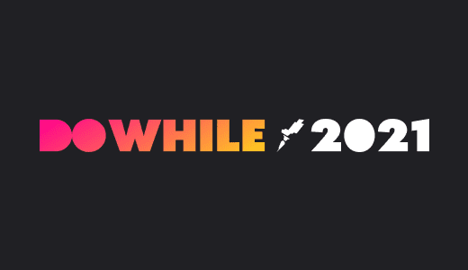
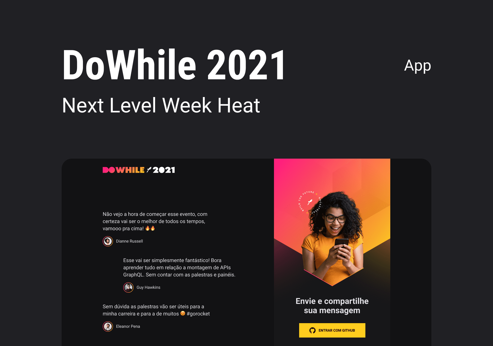

<h1 align="center">🚀 NextLevelWeek - Heat</h1>



<h2>Índice</h2>

- [⚙️ Tecnologias](#️-tecnologias)
- [📖 Projeto](#-projeto)
- [🖌️ Layout](#️-layout)
- [🖥️ Rodando o Projeto](#️-rodando)
---




> Design da aplicação

### ⚙️ Tecnologias

Esse projeto foi feito com as seguintes tecnologias.

- ReactTS
- TypeScript
- SCSS
- NodeJS
- Prisma
- Socket.io
- Vite

### 📖 Projeto

Aplicação fullstack feita no NLW para o evento DoWhile 2021. A aplicação contém comunicação real time com o servidor node e integrações websockets.

### 🖌️ Layout

Disponibilizado pela Rocketseat e utilizado como base para o projeto:

- [Layout](https://www.figma.com/community/file/1031699316177416916)


### 🖥️ Rodando o Projeto

#### Backend

Instalando dependências
```
yarn 
```

Adicione o arquivo .env ao projeto e coloque as variaveis.

```
GITHUB_CLIENT_SECRET= ' OAuth App Client Secret key'
GITHUB_CLIENT_ID= ' OAuth App Client ID'
JWT_SECRET= 'Valor hash md5'
```

adicionando migrate
```
yarn prisma migrate dev
```

visualizar banco de dados
```
yarn prisma studio
```

executando aplicação backend
```
yarn dev
```

A porta [http://localhost:4000](http://localhost:4000)

---

#### Frontend

Instalando dependências
```
yarn 
```

executando aplicação frontend
```
yarn dev
```

A porta [http://localhost:3000](http://localhost:3000)

<p align="center">
  Made with 🚀 by Thalesousa
</p>
